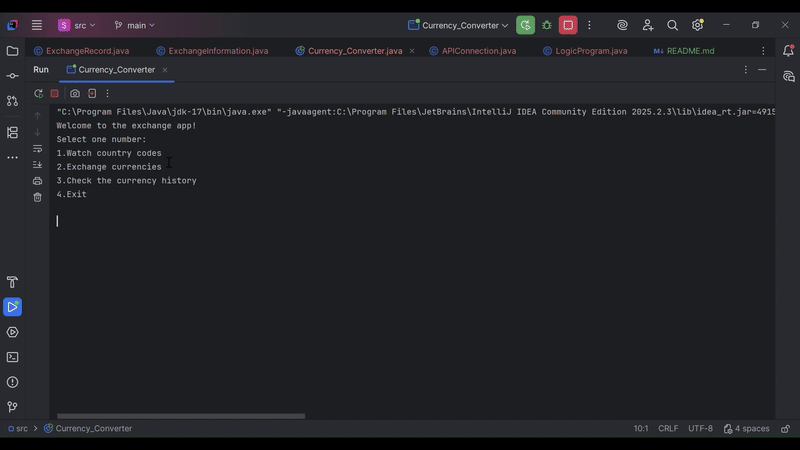
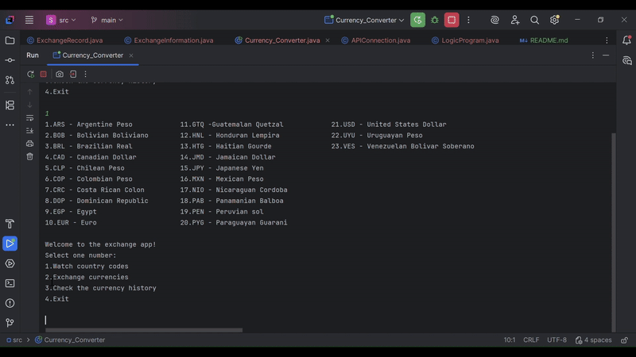
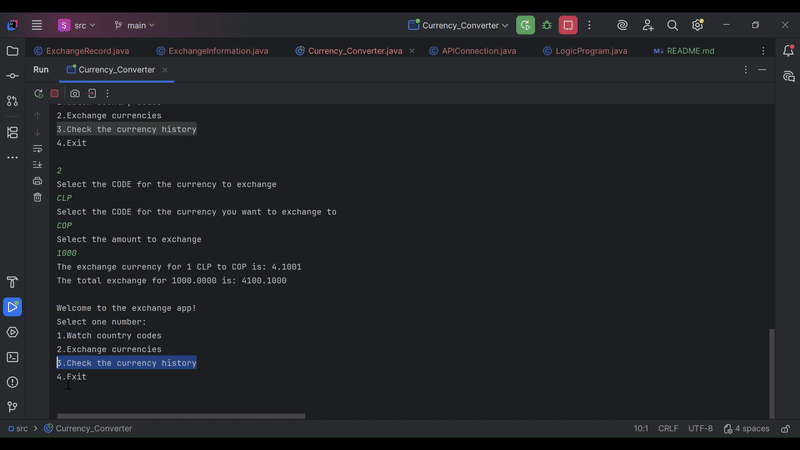

<h1 style = "text-align: center;"> 💲 Currency Converter 💲 </h1> 

 In this project I've created a program 
capable of exchanging different types of currencies. 

## <ins> About the Project</ins> 👨‍🏫
This is a currency converter made for the **ALURA + Oracle** formation Challenge.

## Functionalities
✅Watch all available currencies \
✅Exchange between two currencies\
✅Check the history exchange

## <ins> Use Examples </ins>
### Watch all the currencies available to exchange

### Exchange between two currencies

### Watch the history of exchanges

# <ins> Dependencies 👨‍💻 </ins>
+ [Gson](https://mvnrepository.com/artifact/com.google.code.gson/gson/2.13.2) Version 2.13
+ [ExchangeRate API](https://www.exchangerate-api.com/docs/overview)
